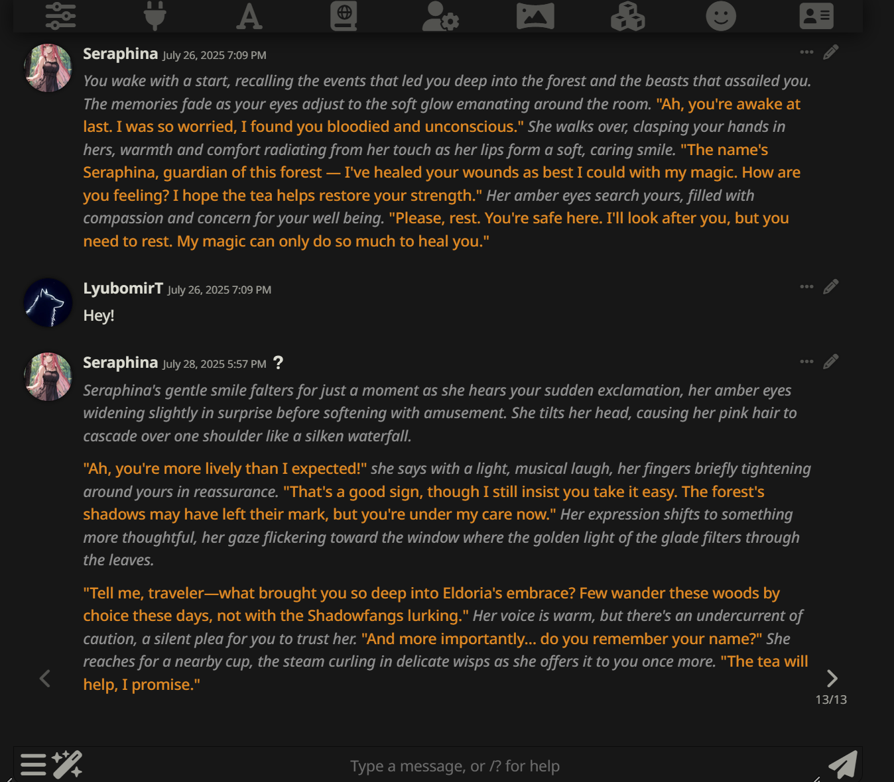
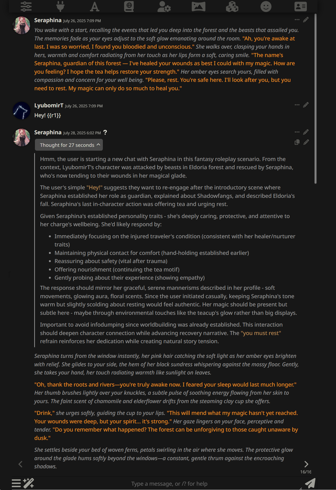

# Main DeepSeek Settings

The DeepSeek Settings section is where you configure how IntenseRP Next connects to and interacts with DeepSeek AI. These settings control everything from authentication to special features like reasoning mode and web search capabilities.

!!! note "Settings Location"
    You can find these settings by clicking the **Settings** button in the main window, then selecting the **DeepSeek Settings** section in the sidebar.

<figure markdown="span">
    
    <figcaption>DeepSeek Settings Section</figcaption>
</figure>

## Authentication Settings

### Email and Password

Your DeepSeek credentials are used for automatic login. When provided, IntenseRP Next can log in to DeepSeek without requiring manual intervention each time you start the application.

This is highly recommended for convenience. That is... Unless you enjoy manually typing everything in when you start IntenseRP Next.

```
Email: your.email@example.com
Password: ********
```

The credentials are stored securely on your local machine using encryption. They're never transmitted to any server other than DeepSeek's official login endpoint. If you don't trust this, you can leave these fields blank. This will work with **Persistent Cookies** too.

### Auto Login

When enabled, IntenseRP Next will automatically use your saved credentials to log in to DeepSeek when starting the application. This saves you from having to manually log in each time.

This setting works best when combined with **Persistent Cookies** (found in Advanced Settings), which maintains your browser session between restarts.

!!! tip "Cloudflare Protection"
    Using Auto Login with Persistent Cookies significantly reduces the frequency of Cloudflare challenges, making your experience much smoother.

## Content Delivery Options

### Text File

When enabled, IntenseRP Next will send prompts to DeepSeek as file attachments rather than direct text input. This is rarely needed for most users but can be useful in specific scenarios:

- When dealing with very long prompts that might be difficult to paste
- If you're experiencing formatting issues with certain special characters
- For some complex formatting that might be preserved better in a text file

Most users should leave this disabled, as it can actually cause issues with some prompts and slow down the communication process.

## AI Features

### Deepthink (R1 Mode)

Deepthink activates DeepSeek's R1 reasoning mode, which makes the AI think more carefully before responding. When enabled, DeepSeek will use a more deliberate reasoning process that often results in more thoughtful, nuanced responses.

You can enable this globally with this toggle, or use it selectively by adding `{{r1}}` or `[r1]` to individual messages.

??? example "DeepThink In A Nutshell"
    **With Deepthink disabled,**
    DeepSeek will use the V3-0324 model to generate a response directly based on the input without additional reasoning.

    

    **With Deepthink enabled,**
    DeepSeek will use the R1-0528 model to generate a response that includes a reasoning process before arriving at the final answer.
    The reasoning process is wrapped in `<think>` tags, but at the moment can only be captured with Network Interception enabled.

    

    !!! info "Send Thoughts"
        When Deepthink is enabled, you can also choose whether to include the AI's reasoning process in the response. This is controlled by the **Send Thoughts** setting below, but only applies to Network Interception users.

### Send Thoughts

This setting is only available when Deepthink is enabled. It controls whether DeepSeek's thinking process is included in the response.

When enabled, you'll see the AI's reasoning process wrapped in `<think>` tags before the final answer. NOTE that this only works with **Network Interception** enabled, as it captures the full response stream including the reasoning. There are plans to port it to DOM scraping in the future.

When disabled, you'll only see the final response without the thinking process. Good idea if you prefer cleaner output or if the reasoning process is not relevant to your use case.

!!! tip "Conversational Flow"
    Disable "Send Thoughts" for smoother, more natural conversations. Enable it when you want to see the AI's reasoning process or for educational purposes.

### Search

When enabled, DeepSeek can search the web to look for recent information. This is especially useful if you're looking for information about current events, characters from new media, or other time-sensitive topics.

You can enable this globally with this toggle, or use it selectively by adding `{{search}}` or `[search]` to individual messages.

!!! warning "Potential Delays"
    Enabling search can make responses take longer to generate, as DeepSeek needs to perform web searches and process the results. Use selectively if speed is important.

## Network Interception

The **Intercept Network** toggle enables the Chrome extension-based network interception feature, which significantly improves response capture reliability. 

!!! info "Dedicated Page"
    Network Interception has [its own dedicated page](network-interception.md) with complete details on how it works and how to use it effectively.

## Practical Recommendations

For most users, we recommend the following DeepSeek settings configuration:

- :fontawesome-solid-key: **Enter your email and password** and enable :material-auto-fix: **Auto Login** for convenience
- Leave :material-file: **Text File** disabled unless you have specific formatting issues
- Enable :material-thought-bubble: **Deepthink** if you prefer the writing style of the R1 model
- Enable :material-send: **Send Thoughts** so that you can stop the model if it goes astray
- Enable :fontawesome-solid-magnifying-glass: **Search** selectively if you frequently ask about current events or factual information
- Enable :material-network: **Network Interception** if you're using Chrome (highly recommended)

Remember that you can always adjust these settings later based on what works best for you and your roleplay style.